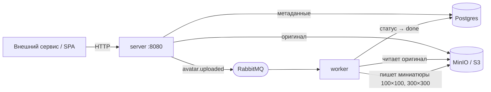
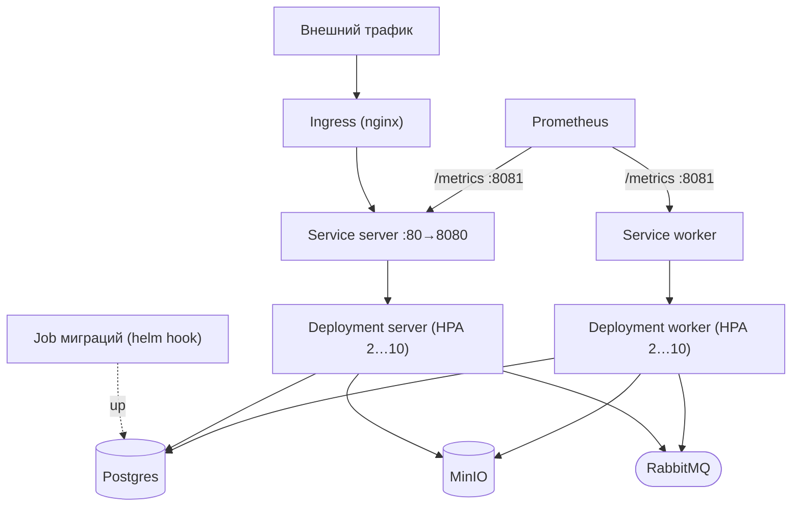

# GophProfile — сервис аватарок

Маленький микросервис на Go, который хранит аватарки пользователей и отдаёт
их по REST API. Пользователь загружает картинку один раз, дальше любой
внешний сервис (форум, блог, виджет комментариев) может получить аватар по
ID пользователя.

Оригинал лежит в S3-совместимом хранилище (локально — MinIO), миниатюры
100×100 и 300×300 генерирует отдельный воркер асинхронно через очередь.

## Что внутри

- HTTP-сервер на `chi`
- Postgres через `pgx/v5`, миграции на `golang-migrate`
- MinIO через `minio-go/v7`
- RabbitMQ через `amqp091-go` (topic-обменник + DLX для terminal-фейлов)
- Ресайз картинок — `disintegration/imaging` (чистый Go, без CGO)
- Структурные логи `log/slog` (с корреляцией по `trace_id`)
- Наблюдаемость: OpenTelemetry-трейсинг → Jaeger, метрики Prometheus + Grafana, логи → Loki, алерты → Alertmanager
- Circuit breaker (`sony/gobreaker`) на походах в S3 и RabbitMQ — больной бэкенд размыкается быстро, а не копит зависшие запросы
- OpenAPI-спека (`api/openapi.yaml`) + Swagger UI на `/swagger`
- Helm-чарт для деплоя в Kubernetes (`helm/gophprofile`)
- Конфиг из env (`caarlos0/env/v11`)
- Тесты — `testify` + `testcontainers-go`, моки через `mockery`

## Архитектура

Два процесса из одного образа: `server` (синхронный HTTP) и `worker`
(асинхронная обработка очереди). Связаны через Postgres (метаданные), MinIO
(файлы) и RabbitMQ (события). Загрузка отвечает клиенту сразу со статусом
`processing`, миниатюры досчитываются в фоне.



В Kubernetes тот же образ разворачивается двумя Deployment'ами под общими
ConfigMap/Secret. Снаружи — Ingress на `server`, метрики обоих процессов
собирает Prometheus через ServiceMonitor с admin-порта `8081`.



Зависимости (Postgres/MinIO/RabbitMQ) в локальном чарте поднимаются
Bitnami-сабчартами; в проде выключаются — подключаешь управляемые сервисы
через `values-prod.yaml`. Подробнее — в разделе
[Деплой в Kubernetes](#деплой-в-kubernetes-helm).

## Как запустить — всё в Docker

Нужен Docker Desktop (или engine + compose v2).

```bash
make up        # весь стек: инфра + app + наблюдаемость (prometheus/grafana/jaeger/loki)
make ps        # проверить что все контейнеры healthy
make logs      # хвост логов compose
```

После старта:

- `http://localhost:8080/web/` — веб-интерфейс (загружай/смотри/удаляй аватарки)
- `http://localhost:8080/swagger` — Swagger UI по OpenAPI-спеке
- `http://localhost:8081/health` — статус компонентов (200 если всё ок, 503 если что-то отвалилось)
- `http://localhost:8081/metrics` — Prometheus-метрики сервера
- `http://localhost:15673/` — RabbitMQ Management UI (guest/guest)
- `http://localhost:9001/` — MinIO Console (minioadmin/minioadmin)
- `http://localhost:3000/` — Grafana (дашборды, вход без пароля) — подробнее в разделе [Наблюдаемость](#наблюдаемость)

> ⚠️ Пароли в `compose.yaml` и `.env.example` — это **dev-дефолты**, чтобы
> можно было собрать стек одной командой. В реальном деплое их нужно убрать
> в secret-store и заменить переменными окружения.

```bash
make down      # остановить, volume'ы не трогаем
```

## Как запустить — приложение на хосте, зависимости в Docker

Так обычно удобнее работать: правишь Go-код, видишь рестарт без пересборки
образа.

```bash
make up                  # только инфраструктура (если ещё не поднята)
cp .env.example .env     # уже настроен на локальные порты
make migrate-up          # накатить схему
make run-server          # терминал A
make run-worker          # терминал B
```

`.env` смотрит на **нестандартные host-порты**, чтобы не конфликтовать с
другими проектами на той же машине:

- Postgres — `5433` (а не 5432)
- RabbitMQ AMQP — `5673`, Management UI — `15673`
- MinIO — стандартные 9000/9001 (там обычно никто не сидит)

Внутри compose сервисы между собой общаются на стандартных портах через
service-name (`postgres:5432`, `rabbitmq:5672` и т.д.) — это переопределено
в `compose.yaml` через `environment:` отдельно от `.env`.

## Наблюдаемость

Тот же `make up` поднимает и стек наблюдаемости. Приложение инструментировано
OpenTelemetry-трейсингом, отдаёт Prometheus-метрики и пишет JSON-логи, которые
собираются в Loki. Всё сводится в Grafana.

| UI | Адрес | Что там |
|---|---|---|
| Grafana | `http://localhost:3000` | дашборды Service Overview + Business KPIs, вход без пароля |
| Jaeger | `http://localhost:16686` | трейсы; сервисы `gophprofile-server` и `gophprofile-worker` |
| Prometheus | `http://localhost:9090` | метрики и алерты (Status → Targets, Alerts) |
| Alertmanager | `http://localhost:9093` | сработавшие алерты |

**Трейсинг.** Каждый запрос — сквозной трейс через все слои: HTTP → сервис →
Postgres → S3 → RabbitMQ. Загрузка аватарки тянется даже через очередь: спан
публикации в server и спан обработки в worker склеены в один `trace_id`
(контекст едет в заголовках сообщения). Приложение шлёт OTLP/gRPC напрямую в
Jaeger (нативный OTLP-приёмник). Опциональный конфиг OTel Collector лежит в
`docker/otel-collector-config.yaml`, если захочется добавить коллектор-хоп.

**Метрики.** Prometheus скрейпит `/metrics` сервера и воркера плюс родной
экспортёр RabbitMQ. Кроме RED-метрик (rate/errors/duration) есть бизнесовые:
`avatars_uploads_total`, `avatars_upload_duration_seconds`,
`avatars_processing_total`, `avatars_storage_bytes`.

**Логи.** `slog` пишет JSON в stdout, Grafana Alloy тейлит логи контейнеров и
шлёт в Loki. В каждую строку внутри спана автоматически добавляются
`trace_id`/`span_id`, так что из лога в Grafana можно в один клик прыгнуть в
соответствующий трейс в Jaeger (и наоборот). ТЗ разрешало стек логов на выбор
(Loki или OpenSearch/ELK) — взяли Loki ради единого окна Grafana на метрики,
логи и трейсы и заметно меньшего расхода ресурсов на локальном стенде.

**Алерты.** Правила в `docker/prometheus/rules/alerts.yml` — высокий процент
5xx, медленные загрузки (p95), фейлы обработки, забитая dead-letter очередь,
упавший таргет. Уходят в Alertmanager.

### Приложение на хосте + трейсинг

Дефолтный OTLP-эндпоинт указывает на `otel-collector:4317` (DNS внутри
compose). Если гоняешь `make run-server` на хосте — переопредели его или
выключи трейсинг:

```bash
OTEL_EXPORTER_OTLP_ENDPOINT=localhost:4317 make run-server   # коллектор опубликован на хост
OTEL_ENABLED=false make run-server                            # или вообще без трейсинга
```

Флаги: `OTEL_ENABLED`, `OTEL_EXPORTER_OTLP_ENDPOINT`, `OTEL_ENVIRONMENT`,
`OTEL_TRACES_SAMPLER_RATIO` (1.0 = трейсить всё; имеет смысл понижать под
нагрузкой).

## Деплой в Kubernetes (Helm)

Чарт лежит в `helm/gophprofile`. Разворачивает два Deployment'а (server +
worker), Service, Ingress, HPA на оба, ConfigMap/Secret, NetworkPolicy,
ServiceMonitor и хук-Job миграций. Зависимости (Postgres/MinIO/RabbitMQ) —
Bitnami-сабчарты, включены в `values-local.yaml` и выключены в
`values-prod.yaml`.

### Что нужно в кластере

Проверялось на **Rancher Desktop** (k8s включён, движок dockerd). В кластере
понадобятся:

- **ingress-nginx** — k3s по умолчанию ставит Traefik, его нужно выключить
  (Rancher Desktop → Preferences → Kubernetes → снять Traefik) и поставить
  ingress-nginx, иначе аннотации `nginx.ingress.kubernetes.io/*` ни на что не
  влияют.
- **kube-prometheus-stack** — даёт CRD `ServiceMonitor` и сам Prometheus.
  Лейбл, по которому он подхватывает ServiceMonitor'ы, задаётся в
  `serviceMonitor.labels` (в `values-prod.yaml` это `release: kube-prometheus-stack`).
- **Локальный registry** — образ собирается локально, а встроенный k3s читает
  не из docker, а из своего хранилища. Проще всего поднять registry и пушить
  туда:
  ```bash
  docker run -d -p 5000:5000 --name registry registry:2
  docker build -t localhost:5000/gophprofile-app:local .
  docker push localhost:5000/gophprofile-app:local
  ```

### Установка (локально)

```bash
cd helm/gophprofile
helm dependency build                 # подтянуть Bitnami-сабчарты
tar xzf charts/*.tgz -C charts/       # helm v4 хочет распакованные сабчарты
cd ../..

helm upgrade --install gophprofile helm/gophprofile \
  -f helm/gophprofile/values-local.yaml \
  --set image.repository=localhost:5000/gophprofile-app \
  --namespace gophprofile --create-namespace

kubectl -n gophprofile rollout status deploy/gophprofile-server
```

Ingress по умолчанию слушает `avatars.localtest.me` (этот домен резолвится в
`127.0.0.1` сам, в `/etc/hosts` лезть не нужно) — открой
`http://avatars.localtest.me/web/`.

### Прод

`values-prod.yaml` выключает Bitnami-сабчарты и ждёт внешние managed-сервисы:
DSN/ключи кладёшь в Secret заранее и указываешь его в `secret.existingSecret`,
а несекретный `MINIO_ENDPOINT` — в `externalMinio.endpoint`. Там же включены
HPA, NetworkPolicy и TLS на Ingress.

Миграции запускаются как **initContainer'ы** в подах приложения (а не
Helm-хуком): SQL запечён в образ, один initContainer копирует его в общий том,
второй гоняет `migrate/migrate ... up`. App-контейнер стартует только после
успешной миграции — поэтому под не примет трафик с пустой схемой, а на свежем
кластере initContainer просто ретраится, пока поднимается БД. Параллельный
запуск на нескольких подах безопасен (golang-migrate берёт advisory-lock).

Отрендеренные манифесты для обоих окружений — в `k8s/rendered/` (удобно
глянуть «сырой» YAML без шаблонов Helm; блок Secret из них вырезан).

## API

| Метод | Путь | Auth | Что делает |
|---|---|---|---|
| `POST` | `/api/v1/avatars` | `X-User-ID` | Загрузить файл (multipart, поле `file`, до 10 MB) |
| `GET` | `/api/v1/avatars/{id}` | — | Стрим оригинала |
| `GET` | `/api/v1/avatars/{id}?size=100x100` | — | Стрим миниатюры (доступные размеры: `100x100`, `300x300`) |
| `GET` | `/api/v1/avatars/{id}/metadata` | — | JSON с метаданными и URL'ами миниатюр |
| `DELETE` | `/api/v1/avatars/{id}` | `X-User-ID`, владелец | Soft-delete + асинхронная очистка S3 |
| `GET` | `/api/v1/users/{user_id}/avatar` | — | Стрим текущей (последней) аватарки пользователя |
| `GET` | `/api/v1/users/{user_id}/avatars` | — | Список всех неудалённых аватарок пользователя |
| `DELETE` | `/api/v1/users/{user_id}/avatar` | `X-User-ID == user_id` | Удалить текущую аватарку |
| `GET` | `/swagger` | — | Swagger UI (спека — `/swagger/openapi.yaml`) |
| `GET` | `/web/*` | — | Статика SPA |

`/health` и `/metrics` живут на отдельном admin-порту (`8081`), а не на
публичном `8080`. В k8s это держит пробы и скрейп Prometheus в стороне от
Ingress; локально оба порта проброшены в compose, так что `curl
localhost:8081/health` работает.

`X-User-ID` принимается **только в формате UUID v7**. Middleware режет
любой другой UUID c 400. Та же проверка применяется к `{user_id}` в пути.

Чтения публичны — это нужный кейс «внешний сайт показывает аватар»: ему
авторизация не нужна, нужен только идентификатор пользователя.

## Структура

```
cmd/
  server/      HTTP-сервер
  worker/      обработчик очереди
internal/
  adminhttp/   admin-роутер (/health, /metrics) — общий для server и worker
  broker/      Publisher + Consumer для RabbitMQ
  config/      env-конфиг
  domain/      Avatar и доменные события
  handlers/    HTTP-хендлеры + health
  httpx/       общие хелперы записи JSON-ответов
  imageproc/   Decode → Fill → JPEG
  logger/      slog setup (+ хендлер корреляции с trace_id)
  metrics/     Prometheus-инструменты (RED, бизнес-метрики, пул, runtime)
  middleware/  RequestID-friendly logger, валидатор X-User-ID, трейс-спаны
  observability/ OpenTelemetry: init трейс-провайдера, пропагаторы
  repository/  pgx-обвязка
  resilience/  circuit breaker'ы вокруг S3 и RabbitMQ
  services/    use-case оркестрация (сага компенсации в Upload)
  storage/     MinIO-адаптер
  worker/      обработчики событий (идемпотентны через DB-статус)
api/           OpenAPI-спека (embed в бинарь, отдаётся на /swagger)
migrations/    SQL-миграции
helm/          Helm-чарт gophprofile (деплой в k8s)
k8s/           отрендеренные манифесты (helm template) для ревью
docker/        конфиги наблюдаемости (collector, prometheus, loki, alloy, grafana)
tests/         e2e-тест со всеми зависимостями (testcontainers, build tag `integration`)
web/static/    SPA (один HTML, Tailwind через CDN, vanilla JS)
```

Внутри каждого слоя — поддиректория по агрегату (`internal/services/avatar/`,
`internal/handlers/avatar/`), и **по файлу на публичный метод**. Имена типов
без префикса агрегата: `avatar.Service`, `avatar.Repository`, не
`AvatarService` / `AvatarRepository`.

## Тесты

```bash
make test              # юнит + пер-пакетные интеграционные (testcontainers внутри)
make test-integration  # e2e через весь стек (testcontainers, ~15-30s)
make lint              # golangci-lint
```

E2e-тест поднимает реальные PG/MinIO/RMQ в testcontainers, запускает
in-process воркер и HTTP-сервер, делает полный цикл upload → ждёт миниатюр
→ скачивает → удаляет → проверяет что worker почистил S3.

## Make-таргеты

```
make up                  поднять весь стек
make down                остановить
make logs / make ps      что там в compose
make run-server          запустить сервер на хосте против дockerized-зависимостей
make run-worker          то же для воркера
make migrate-up/down     накатить/откатить миграции (через host migrate CLI)
make test                юнит-тесты
make test-integration    e2e
make lint                golangci-lint
make mocks               перегенерить моки через mockery
make build               собрать бинарники в bin/
make docker-build        собрать app-image без запуска
make helm-deps           подтянуть и распаковать Bitnami-сабчарты
make helm-lint           прогнать helm lint (default + prod)
make helm-template       отрендерить манифесты в k8s/rendered/
make help                этот список
```

## Что нужно поставить на хост для dev

- Go 1.25+
- Docker (Desktop или engine + compose v2)
- `migrate` CLI — если хочешь использовать `make migrate-up` с хоста:
  ```
  go install -tags 'postgres' github.com/golang-migrate/migrate/v4/cmd/migrate@latest
  ```
- `mockery` v2 — если будешь править интерфейсы и регенерить моки:
  ```
  go install github.com/vektra/mockery/v2@latest
  ```
- `golangci-lint` v2:
  ```
  brew install golangci-lint
  # или
  go install github.com/golangci/golangci-lint/v2/cmd/golangci-lint@latest
  ```
- `helm` v3+ и доступ к кластеру (`kubectl`) — только если будешь деплоить в
  k8s (см. [Деплой в Kubernetes](#деплой-в-kubernetes-helm)):
  ```
  brew install helm
  ```

В compose ничего из этого не требуется — migrator там отдельный one-shot
сервис на официальном образе `migrate/migrate`.

## Чего пока нет

Прямо сейчас сервис работает, но это всё ещё MVP. Что в голове на потом:

- Автореконнект к RabbitMQ — сейчас если коннект порвался, процесс падает.
  Перезапуск процесса обходит проблему, но в проде хочется аккуратнее.
- Outbox-паттерн или reconciliation-job для случая «положили в БД, не
  успели опубликовать событие». Сейчас в этом случае пишем WARN и идём
  дальше, аватар остаётся со статусом `pending`.
- Если воркер упал ровно посреди обработки, запись зависает в статусе
  `processing`. Нужна джоба-сторож, которая возвращает их в `pending` через
  N минут.
- `width`/`height` в metadata — в схеме нет; добавим, если появится
  потребность.
- CI пока не настроен.
